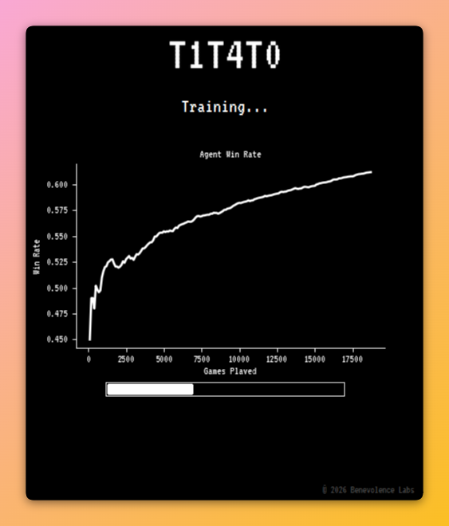
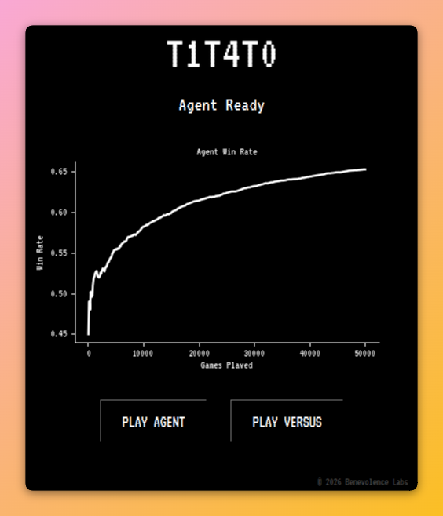
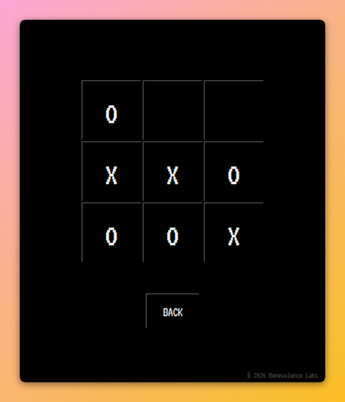

# TITATO


A graphical Tic Tac Toe game built in Python featuring a Q-learning agent alongside a live training graph.

## Overview
TITATO is an interactive, GUI-based tic tac toe game. Beyond standard local gameplay, it implements a Reinforcement Learning backend. The AI agent learns through Q-learning, improving by playing 50,000 self-play games and updating a Q-table based on rewards and penalties. Once trained, it provides a challenging opponent for the player.

## Preview




## Features
- Q-Learning agent
- Live training graph
- Human vs AI mode
- Human vs Human mode
- Retro-styled Tkinter interface

## Built With
- [Python](https://python.org) - Core programming language.
- [Tkinter](https://python.org) - Graphical user interface framework.
- [Matplotlib](https://matplotlib.org/) - Displays the agent's training progress.

## Getting Started

### Prerequisites

#### For Developers
Ensure you have Python 3.8 or higher installed on your machine:
```bash
python --version
```
Install Matplotlib to enable the live training graph:
##### Using pip (recommended)
```bash
pip install matplotlib
```

### Installation

#### For Players
Download the latest Windows executable from the [Releases](../../releases) page.

#### For Developers
Clone this repository to your local machine:
   ```bash
   git clone https://github.com/9mus/titato.git
   cd titato
   python t1t4t0.py
   ```

## Authors
Developed by [9musa](https://github.com/9musa) under Benevolence Labs.

## License
This project is licensed under the MIT License - see the [LICENSE](LICENSE) file for details.
